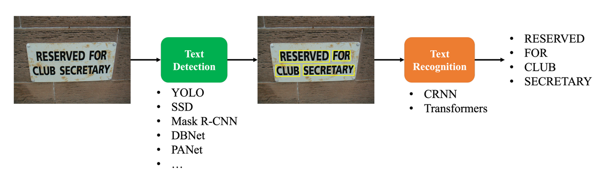
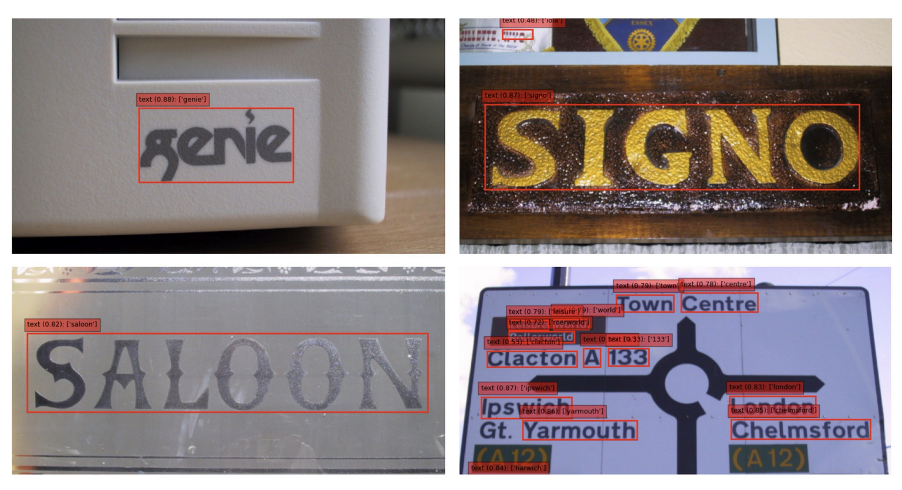

# Scene Text Detection Project

## Introduction

Nhận dạng Văn bản trong Ảnh (Scene Text Recognition) là một bài toán ứng dụng các kỹ thuật xử lý hình ảnh và nhận dạng chữ viết để xác định các văn bản xuất hiện trong các bức ảnh chụp từ môi trường thực tế. Bài toán này có nhiều ứng dụng thực tế, chẳng hạn như:

- Xử lý văn bản trong ảnh: Nhận diện chữ trong các loại tài liệu, báo chí, biển hiệu,...
- Tìm kiếm thông tin: Nhận diện chữ trong ảnh trên internet để thu thập dữ liệu quan trọng.
- Tự động hóa quy trình: Nhận diện chữ trong ảnh để tự động hóa các công việc, ví dụ như xử lý
  đơn hàng, thanh toán,...

Quy trình Nhận dạng Văn bản trong Ảnh điển hình gồm hai giai đoạn chính:

- Phát hiện chữ viết (Detector): Xác định vị trí các khối văn bản trong ảnh.
- Nhận diện chữ viết (Recognizer): Giải mã văn bản tại các vị trí đã được xác định.



Trong dự án này, chúng ta sẽ phát triển một chương trình Nhận dạng Văn bản trong Ảnh sử dụng YOLOv11 (cho việc phát hiện văn bản) và CRNN (cho việc nhận dạng chữ) cho tập dataset ICDAR2003. Đầu vào và đầu ra của chương trình như sau:
• Đầu vào: Một bức ảnh chứa văn bản.
• Đầu ra: Tọa độ vị trí và nội dung văn bản trong ảnh.

Sau đó chúng ta sẽ xây dựng giao diện bằng Streamlit.

## Results


## Notebooks

- STR_Detection: notebook sử dụng YOLOv11 cho việc phát hiện văn bản.
- STR_Recognition: notebook sử dụng CRNN cho việc nhận dạng chữ viết.
- STR_Full_Pipeline: notebook đầy đủ pipeline nhận dạng văn bản trong ảnh, bao gồm cả Detector và Recognizer.

## Setup Env

```bash
python -m venv .venv
source .venv/bin/activate
pip install -r requirements.txt
```

## Run Server

```bash
cd deployment
make init
```

## Start deployment

```bash
cd deployment
make deploy_ocr
```

## Start the Streamlit App

```bash
cd deployment
make streamlit
```

- Dashboard: `localhost:8265`
- Swagger UI: `localhost:8000/docs`
- UI: `localhost:8501`
